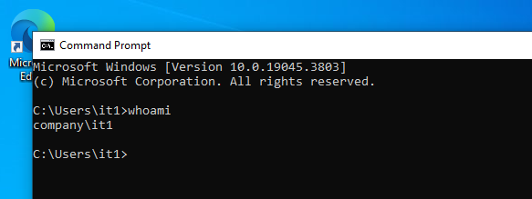
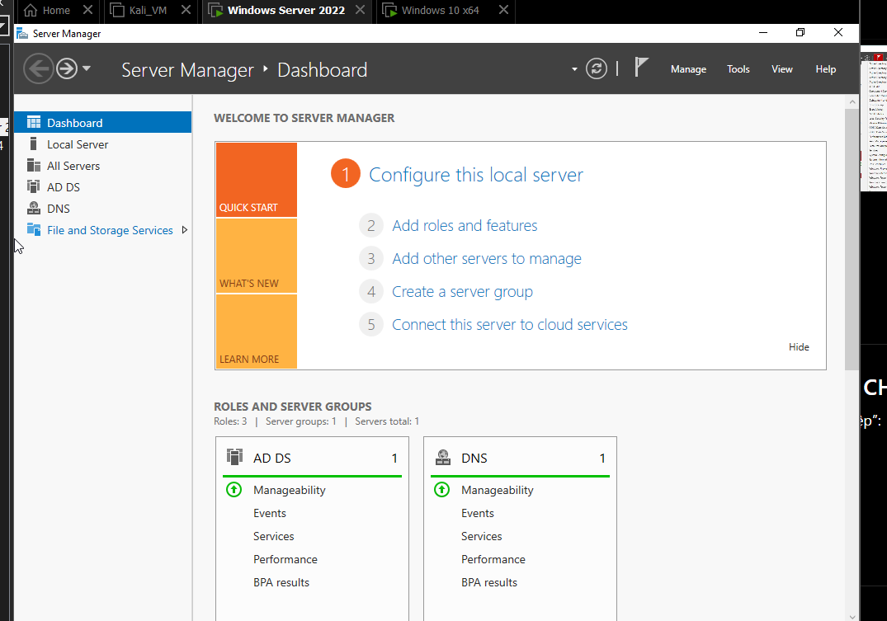
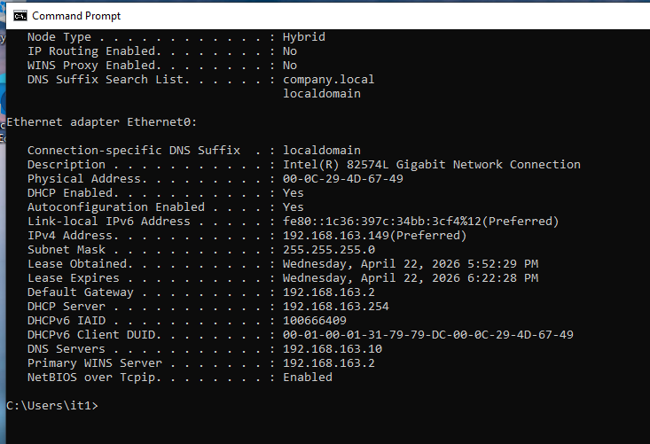
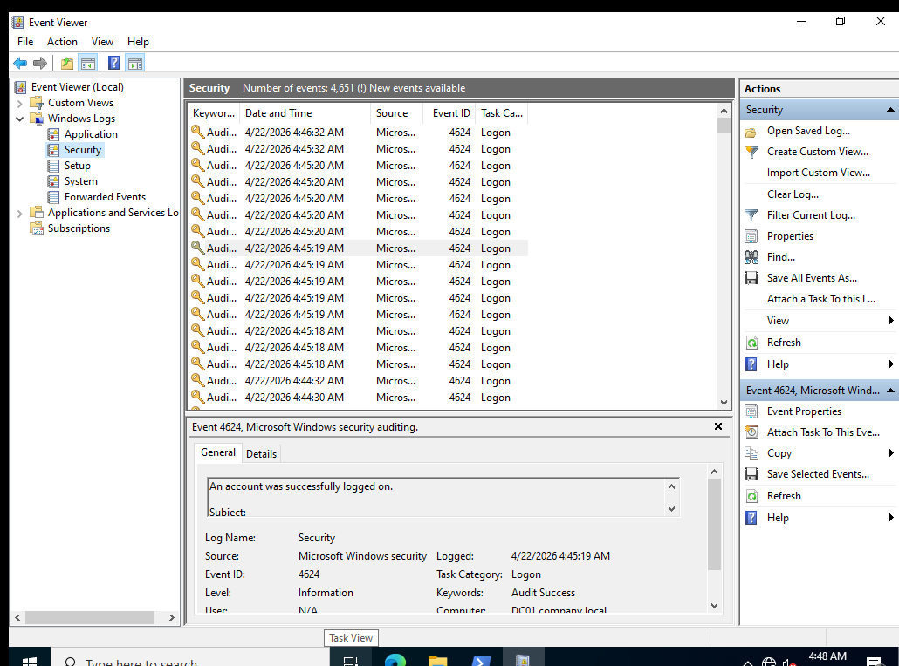

# Windows Server 2022 Infrastructure Lab

## Overview  
This project involved creating a Windows Server 2022 lab environment within VMware, comprising one Domain Controller and one Windows 10 client to simulate a small enterprise infrastructure. The setup focuses on core IT services such as Active Directory, DNS, DHCP, domain joining, GPO drive mapping, and audit logging.

## Key Services Implemented  
- **Active Directory Domain Services (AD DS)**: Centralized management of users, groups, and security policies.
- **DNS Configuration**: Implemented DNS to support name resolution and the Active Directory environment.
- **DHCP Configuration**: Set up DHCP for dynamic IP address allocation across the network.
- **Domain Join**: Configured a Windows 10 machine to join the domain for centralized management.
- **Group Policy Objects (GPO) - Drive Mapping**: Applied GPOs to automate the mapping of network drives for users within the domain.
- **Audit Logging**: Enabled auditing to monitor logon activity and access control changes, improving security monitoring.

## Screenshots  

### Active Directory Setup  

### DNS Configuration  

### DHCP Configuration  

### Group Policy - Map Drive  

### Event Logs (Audit)  

## Step-by-Step Setup Guide  
1. Install **Windows Server 2022** on VMware, setting up the necessary virtual machines.
2. Configure **Active Directory Domain Services (AD DS)** and ensure the domain controller is operational.
3. Set up **DNS** and **DHCP** services to enable network and device communication.
4. Add a **Windows 10 client** to the domain to test connectivity and domain policies.
5. Apply **Group Policy** for automatic drive mapping, ensuring users have the required network resources available.
6. Enable **Audit Logging** to track system access and enhance security.

## Conclusion  
This lab environment provides a comprehensive simulation of a small business IT infrastructure, offering real-world experience with essential services such as **Active Directory**, **DNS**, **DHCP**, and **GPO management**. The implementation of **Audit Logging** ensures robust security and compliance monitoring, making this setup an ideal model for enterprise environments.
